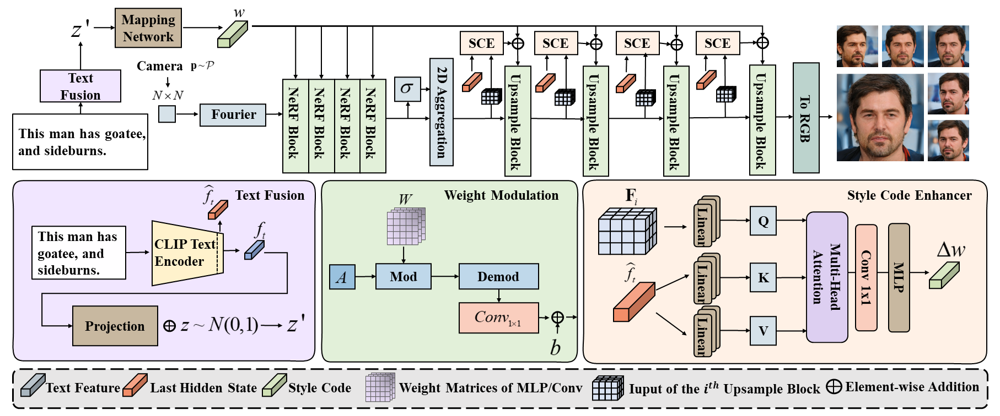
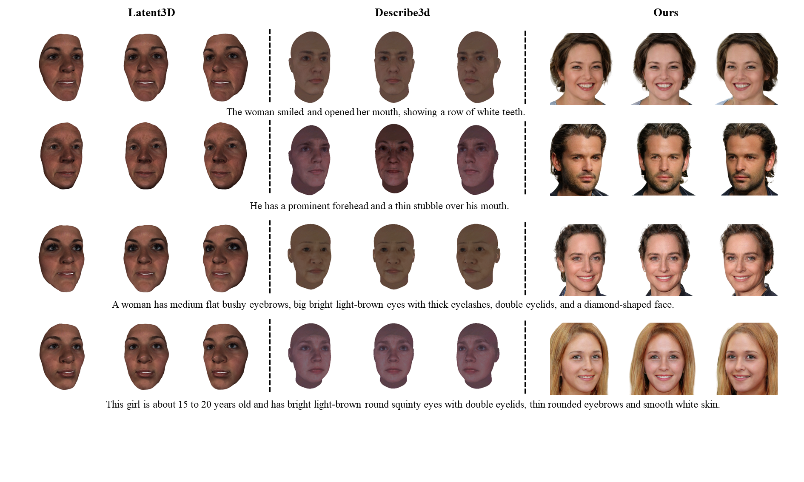
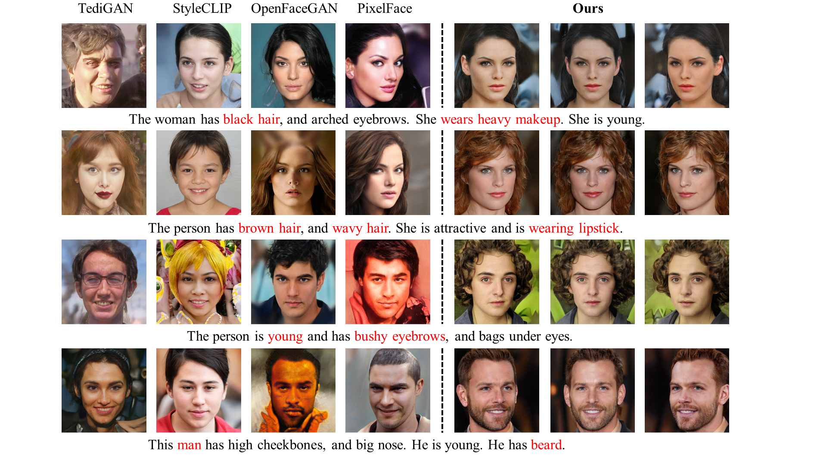

## Fast Text-to-3D-Aware Face Generation and Manipulation via Direct Cross-modal Mapping and Geometric Regularization

### Abstract

Text-to-3D-aware face (T3D Face) generation and manipulation is an emerging research hot spot in machine learning, which still suffers from low efficiency and poor quality. In this paper, we propose an \emph{\textbf{E}nd-to-End \textbf{E}fficient and \textbf{E}ffective} network for fast and accurate T3D face generation and manipulation, termed $E^3$-FaceNet. Different from existing complex generation paradigms, $E^3$-FaceNet resorts to a direct mapping from text instructions to 3D-aware visual space. We introduce a novel \emph{Style Code Enhancer} to enhance cross-modal semantic alignment, alongside an innovative \emph{Geometric Regularization} objective to maintain consistency across multi-view generations. Extensive experiments on three benchmark datasets demonstrate that $E^3$-FaceNet can not only achieve picture-like 3D face generation and manipulation, but also improve inference speed by orders of magnitudes. For instance, compared with Latent3D, $E^3$-FaceNet speeds up the five-view generations by almost 470 times, while still exceeding in generation quality.

### Overview




### Getting Start

The model weight can be download at [here](https://drive.google.com/file/d/1msBAgRYo_o3yT9Nx1q86KMZRoboxkpxB/view?usp=sharing)

### Training E3-FaceNet

use the shell script,

```
bash train_train_4_E3_Face.sh
```

### Evaluate E3-FaceNet

use the shell script,

```
bash run_eval_4_E3_Face.sh
```

### Text-Guided Generation and Manipulation

use the shell script,

```
bash sample.sh
```


### Visual Results

#### Compare with Text-to-3D Face Methods



#### Compare with Text-to-2D Face Methods



